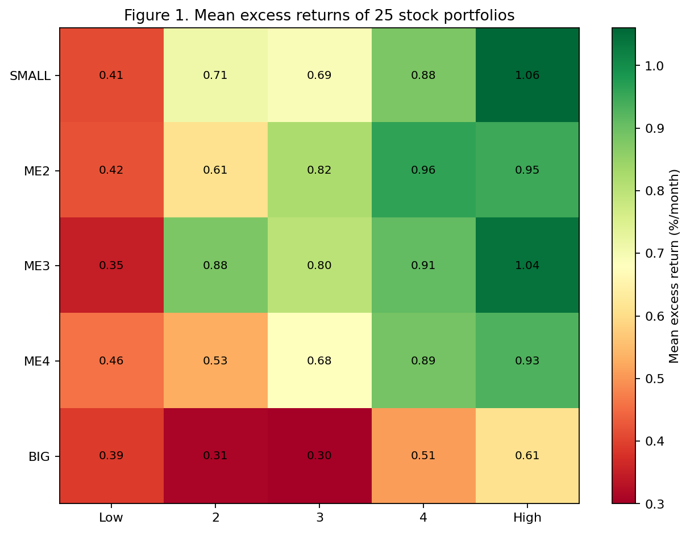
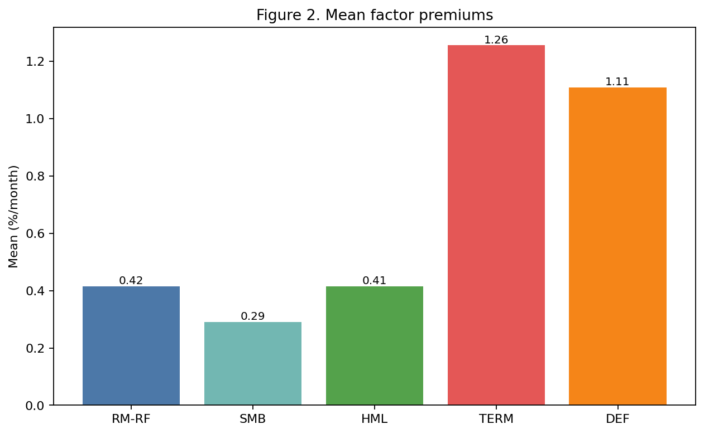
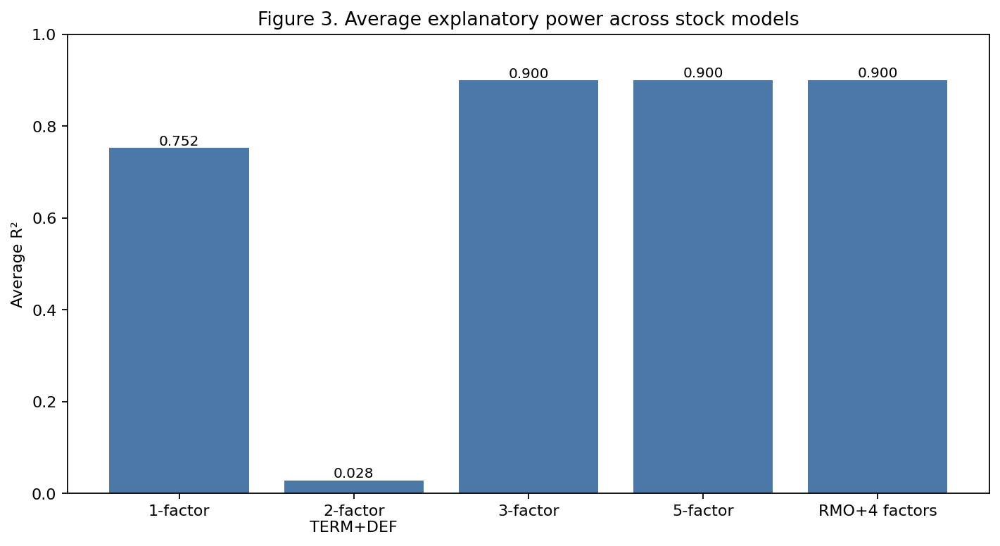
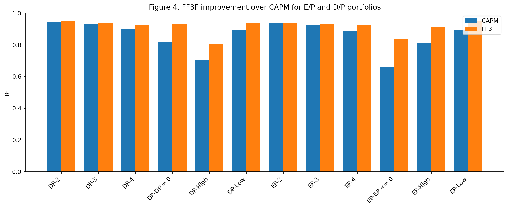
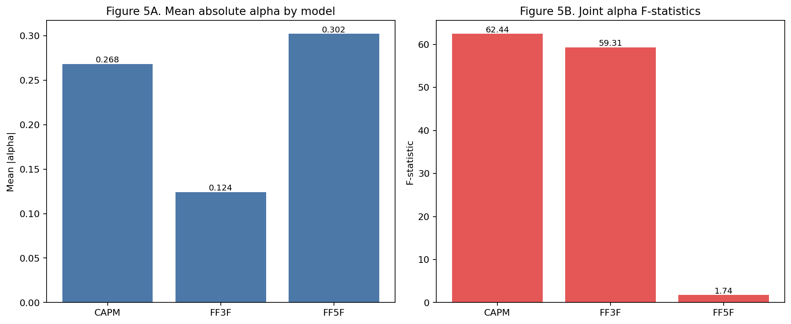

# Fama-French (1993) 과제 제출 패키지

이 저장소는 **Fama & French (1993), _Common Risk Factors in the Returns on Stocks and Bonds_**의 핵심 결과를 과제 제출 형식으로 재현한 패키지다. 저장소는 더 이상 연구용 `output/` 중심 구조가 아니라, **제출용 산출물 `appendix_output/`만 공식 결과 디렉토리**로 사용한다.

핵심 목표는 두 가지였다.

1. 논문과 과제 가이드(`Fama-French 1993 재현 및 정리.md`)가 요구하는 표를 다시 만들기
2. 각 표가 논문의 어떤 주장과 연결되는지 README에서 직접 설명하기

---

## 1. 제출 패키지 사용법

### 공식 제출 산출물

- 제출용 결과 디렉토리: `appendix_output/`
- 제출용 빌드 스크립트: `build_submission.py`
- 표 커버리지 감사 문서: `TABLE_COVERAGE_AUDIT.md`

### 재생성 방법

```bash
python build_submission.py
python -m pytest -q
```

최근 검증 결과:

- `274 passed, 1 skipped`

---

## 2. 무엇을 어떻게 구현했는가

### 2.1 주식 포트폴리오 구성

주식 측 구현의 중심은 `compustat_portfolio_builder.py`다.

- Compustat BE(`compustat_be.csv`)의 pre-computed book equity를 사용했다.
- CRSP raw 데이터에서 `PRC`, `RET`, `SHROUT`, `PERMNO`, `PERMCO`를 읽었다.
- `gvkey → PERMCO → PERMNO` 연결로 Compustat과 CRSP를 묶었다.
- 매년 6월 NYSE breakpoint로 25개 Size×BE/ME 포트폴리오를 구성했다.
- 6개 2×3 포트폴리오도 함께 만들고 여기서 SMB/HML을 재계산했다.

논문 방법론상 1963-07 시점 포트폴리오를 만들려면 1962년 BE가 필요한데, 현재 데이터엔 그 연도가 없어서 **1963-07~1964-06은 seed/hybrid 구간**, 1964-07 이후는 자체 구축 구간으로 처리했다.

### 2.2 채권 요인 및 채권 프록시

채권 측은 논문 원자료를 그대로 복원할 수 없어서 FRED 기반 프록시로 구현했다.

- TERM = 장기 국채 수익률 − 단기 무위험 수익률
- DEF = BAA − AAA 신용스프레드
- 채권 포트폴리오는 실제 CRSP 채권 수익률이 아니라 yield-based proxy

그래서 채권 관련 결과는 “원 논문과 숫자까지 일치”를 증명하는 용도보다, **채권 요인과 주식 요인의 분리 구조가 나타나는지**를 확인하는 용도로 해석했다.

### 2.3 과제 제출용 표 구성기

`10_appendix_table_exports.py`가 최종 제출용 표를 정리한다.

이 스크립트는:

- 과제 가이드에서 **포함하라고 한 표만** `appendix_output/`에 저장하고
- 제외 대상인 bond block(Table 3 bond, Table 7b 등)은 파일 수준에서 빼며
- Table 9a/9c처럼 과제에 맞는 형태로 다시 편집한다.

### 2.4 제출용 시각화

`11_submission_visualizations.py`는 appendix 표에서 바로 읽어 제출용 그림을 만든다.

- `submission_fig1_stock_mean_heatmap.png`
- `submission_fig2_factor_premiums.png`
- `submission_fig3_model_r2.png`
- `submission_fig4_ep_dp_r2.png`

즉, 지금 README에 나오는 그림은 “연구용 전체 출력”이 아니라 **제출용 appendix 결과를 직접 시각화한 그림**이다.

---

## 2.5 표별 데이터 출처와 전처리

| 표 | 원천 데이터 | 전처리 | 최종 제출 파일 |
|---|---|---|---|
| Table 1 | `compustat_be.csv`, CRSP raw (`PRC`, `RET`, `SHROUT`, `PERMNO`, `PERMCO`) | common stock 필터, ME 계산, NYSE breakpoint, 25포트폴리오 분류, formation year별 평균 기업수/시총/시총비중 계산 | `appendix_output/table1_panel1_firm_count_market_cap.csv`, `appendix_output/table1_panel2_cap_share_firm_count.csv` |
| Table 2 panel 1 | `appendix_output/factors.csv`, `appendix_output/bond_portfolios_excess.csv` | RM, TB, LTG, CB, RM-RF, RMO, SMB, HML, TERM, DEF 시계열의 평균/표준편차/t값/자기상관 계산, 상관행렬 생성 | `appendix_output/table2_panel1_factor_summary.csv`, `appendix_output/table2_panel1_correlation_matrix.csv` |
| Table 2 panel 2-3 | `appendix_output/stock_portfolios_excess.csv` | 25개 주식 포트폴리오의 월 초과수익률에서 mean/std 및 t-stat 추출, 5×5 그리드로 재배열 | `appendix_output/table2_panel2_stock_mean_std.csv`, `appendix_output/table2_panel3_stock_tstats.csv` |
| Table 3 | `appendix_output/stock_portfolios_excess.csv`, `appendix_output/factors.csv` | 식 `R-RF = a + m·TERM + d·DEF + e`를 25개 주식 포트폴리오에 회귀, `m`, `d`, `R²`, `s(e)`만 추출 | `appendix_output/table3_*` |
| Table 4 | `appendix_output/stock_portfolios_excess.csv`, `appendix_output/factors.csv` | 식 `R-RF = a + b·(RM-RF) + e` 회귀 후 `b`, `R²`, `s(e)` 추출 | `appendix_output/table4_*` |
| Table 5 | `appendix_output/stock_portfolios_excess.csv`, `appendix_output/factors.csv` | 식 `R-RF = a + s·SMB + h·HML + e` 회귀 후 `s`, `h`, `R²`, `s(e)` 추출 | `appendix_output/table5_*` |
| Table 6 | `appendix_output/stock_portfolios_excess.csv`, `appendix_output/factors.csv` | 식 `R-RF = a + b·(RM-RF) + s·SMB + h·HML + e` 회귀 후 `b,s,h,R²,s(e)` 추출 | `appendix_output/table6_*` |
| Table 7a | `appendix_output/stock_portfolios_excess.csv`, `appendix_output/factors.csv` | 식 `R-RF = a + b·(RM-RF) + s·SMB + h·HML + m·TERM + d·DEF + e` 회귀 후 6개 패널 추출 | `appendix_output/table7a_*` |
| Table 8a | `appendix_output/stock_portfolios_excess.csv`, `appendix_output/factors.csv` | 먼저 `RM-RF`를 `SMB,HML,TERM,DEF`에 회귀해 RMO를 만들고, 이후 `R-RF = a + b·RMO + s·SMB + h·HML + m·TERM + d·DEF + e` 회귀 | `appendix_output/table8a_*`, `appendix_output/table8a_rmo.csv`, `appendix_output/rmo.csv` |
| Table 9a | Table 3~7a에 쓰인 동일 입력 | 모형 (i)~(v)를 각 포트폴리오에 다시 회귀하고 alpha/t(alpha)만 행렬로 재정리 | `appendix_output/table9a_stock_alphas.csv` |
| Table 9c | `appendix_output/stock_portfolios_excess.csv`, `appendix_output/bond_portfolios_excess.csv`, `appendix_output/factors.csv` | 32개 자산 전체에 대해 GRS 방식 F-test 계산, 평균 절대 alpha와 p-value 기록 | `appendix_output/table9c_joint_tests.csv` |
| Table 11 | `data/ep_dp_portfolios.csv`, `appendix_output/factors.csv` | raw return mean/std/t, CAPM 회귀, FF3F 회귀를 수행해 long-format으로 저장 | `appendix_output/table11_ep_dp_long.csv`, `appendix_output/table11_ep_dp.csv` |

---

## 3. 논문의 어떤 부분을 어떻게 증명했는가

아래 표는 논문 주장, 구현 파일, 제출 파일, 그리고 무엇을 증명하는지의 연결표다.

| 논문/가이드 항목 | 구현 파일 | 제출 파일 | 증명하는 내용 |
|---|---|---|---|
| Table 1 (1)(2) | `07_section0_descriptive_stats.py` | `appendix_output/table1_panel1_firm_count_market_cap.csv`, `appendix_output/table1_panel2_cap_share_firm_count.csv` | 25개 포트폴리오가 실제로 형성되었고, size sorting과 시가총액 비중 구조가 유지됨 |
| Table 2 | `01_section2_factors.py`, `02_section2_portfolios.py`, `10_appendix_table_exports.py` | `appendix_output/table2_*` | 요인 평균/분산/자기상관, 그리고 25개 주식 포트폴리오 평균 수익률 패턴을 확인 |
| Table 3 | `10_appendix_table_exports.py` | `appendix_output/table3_*` | TERM·DEF가 주식 횡단면에는 제한적인 설명력만 가짐 |
| Table 4 | `04_section4_regressions.py`, `10_appendix_table_exports.py` | `appendix_output/table4_*` | 시장 요인 하나만으로는 주식 설명력이 충분하지 않음 |
| Table 5 | `10_appendix_table_exports.py` | `appendix_output/table5_*` | SMB/HML이 규모 효과·가치 효과를 반영함 |
| Table 6 | `04_section4_regressions.py`, `10_appendix_table_exports.py` | `appendix_output/table6_*` | 3요인 모형이 설명력을 크게 높임 |
| Table 7a | `04b_section4_five_factor.py`, `10_appendix_table_exports.py` | `appendix_output/table7a_*` | TERM/DEF를 추가해도 주식 설명력 개선은 작음 |
| Table 8a | `08_section8a_rmo_regressions.py`, `10_appendix_table_exports.py` | `appendix_output/table8a_*`, `appendix_output/table8a_rmo.csv` | RMO가 나머지 4요인과 직교하면서도 주식 설명력을 유지함 |
| Table 9a | `05b_section5_intercepts.py`, `10_appendix_table_exports.py` | `appendix_output/table9a_stock_alphas.csv` | 절편(alpha) 크기를 비교해 pricing error를 평가 |
| Table 9c | `05_section5_grs_test.py`, `10_appendix_table_exports.py` | `appendix_output/table9c_joint_tests.csv` | 절편 공동검정(F-test)으로 모형의 전체 설명력을 평가 |
| Table 11 | `09_section11_ep_dp_portfolios.py` | `appendix_output/table11_ep_dp_long.csv` | E/P, D/P 정렬 포트폴리오에서 FF3F가 CAPM보다 더 높은 설명력을 보임 |

---

## 3.1 표별로 어떻게 논문 주장을 증명했는가

### Table 1 — 25개 포트폴리오 형성 자체의 증명

Table 1은 “포트폴리오가 실제로 올바르게 형성됐는가”를 보여주는 구조 검증 표다. `appendix_output/table1_panel1_firm_count_market_cap.csv`에서 SMALL-LOW 셀은 `419.04 / 23438.43`, BIG-LOW 셀은 `84.71 / 3848010.65`로 나타난다. 즉 소형주 셀은 종목 수가 훨씬 많지만 평균 시가총액은 매우 작고, 대형주 셀은 종목 수는 적지만 평균 시가총액은 매우 크다. 이 패턴은 NYSE size breakpoint 기반 분류가 실제로 작동했다는 직접 증거다. `table1_panel2_cap_share_firm_count.csv`는 SMALL 쪽 시총 비중이 매우 작고 BIG 쪽 비중이 압도적으로 크다는 점을 추가로 보여준다.

### Table 2 — 논문의 기본 사실(size effect, value effect)의 원자료 증명

Table 2는 논문 핵심 주장인 size effect와 value effect가 데이터에 실제로 존재하는지를 보여주는 표다. `appendix_output/table2_panel2_stock_mean_std.csv`에서 SMALL-HIGH BM 평균 초과수익률은 약 `1.06%/월`, BIG-LOW BM은 약 `0.39%/월`이다. 즉 가치주(High BM)가 성장주(Low BM)보다 높고, 같은 BM 그룹 안에서는 소형주 쪽 수익률이 더 높은 패턴이 관측된다. `appendix_output/table2_panel1_factor_summary.csv`는 RM-RF `0.4152`, SMB `0.2906`, HML `0.4148`의 양(+)의 평균을 보여주며, 논문이 주장한 규모·가치 프리미엄이 이 구현에서도 살아 있음을 뒷받침한다.

### Table 3 — TERM/DEF만으로는 주식을 잘 설명하지 못한다는 증명

Table 3의 목적은 채권요인 TERM과 DEF가 주식 수익률 횡단면의 주된 설명변수가 아니라는 점을 보이는 것이다. `appendix_output/table3_panel3_r2_se.csv`의 25개 셀을 평균하면 주식 쪽 R²는 약 `0.0284`에 불과하다. 몇몇 셀에서 TERM 또는 DEF의 t값이 유의할 수는 있지만, 전체 설명력은 매우 낮다. 따라서 이 표는 “채권요인은 채권 쪽에는 중요하지만 주식에는 핵심 설명변수가 아니다”라는 논문 메시지를 지지한다.

### Table 4 — 시장요인 하나만으로는 불충분하다는 증명

Table 4는 CAPM식 단일요인 모형 검정이다. `appendix_output/table4_panel1_b_t_b.csv`를 보면 시장 베타는 대부분 강하게 유의하다. 하지만 `appendix_output/table4_panel2_r2_se.csv`를 평균하면 설명력은 약 `0.7524`다. 즉 시장요인은 중요하지만, 이 정도로는 Table 2에서 본 size/value 패턴을 모두 설명하지 못한다. 그래서 이 표는 “시장 하나만으로는 부족하다”는 논문 문제의식을 수치로 보여주는 역할을 한다.

### Table 5 — SMB/HML이 정말 size/value 구조를 잡는다는 증명

Table 5는 `SMB`, `HML`만으로 주식 포트폴리오를 설명할 때 어떤 loading이 나오는지 본다. `appendix_output/table5_panel1_s_t_s.csv`에서는 25개 포트폴리오의 SMB 계수가 모두 양(+)이고, 평균적으로 작을수록 더 크게 잡힌다. `appendix_output/table5_panel2_h_t_h.csv`에서는 Low BM 쪽 계수는 음(-), High BM 쪽 계수는 양(+)으로 나타난다. 즉 SMB는 규모 효과, HML은 가치 효과를 반영하는 요인 모방수익률이라는 논문 정의가 실제 결과에서도 드러난다.

### Table 6 — 3요인 모형이 주식 수익률 설명력을 크게 높인다는 증명

Table 6은 논문의 가장 중요한 주장 중 하나를 직접 검정한다. `appendix_output/table6_panel4_r2_se.csv`의 25개 셀 평균 R²는 약 `0.9000`이며, 이는 Table 4의 `0.7524`보다 약 `+0.1476` 높다. 즉 Mkt-RF 하나만 쓰는 단일요인 모형보다, `Mkt-RF + SMB + HML`의 3요인 모형이 주식 수익률 공통변동을 훨씬 잘 설명한다. 이 표가 바로 “Fama-French 3요인 모형이 CAPM보다 우월하다”는 과제의 핵심 증거다.

### Table 7a — TERM/DEF를 더해도 주식 쪽 개선은 거의 없다는 증명

Table 7a는 5요인 모형을 주식 포트폴리오에 적용한 결과다. `appendix_output/table7a_panel6_r2_se.csv`의 평균 R²는 약 `0.9004`로, Table 6의 `0.9000`보다 개선폭이 겨우 `+0.0004` 수준이다. 또 `appendix_output/table7a_panel4_m_t_m.csv`, `table7a_panel5_d_t_d.csv`를 보면 TERM/DEF가 일부 셀에서만 약하게 유의하고 전반적으로 핵심 설명축은 아니다. 따라서 Table 7a는 “채권요인을 더해도 주식 수익률 설명력은 거의 늘지 않는다”는 논문 해석을 직접 뒷받침한다.

### Table 8a — 직교화한 시장요인(RMO)도 여전히 핵심이라는 증명

Table 8a는 시장요인의 독립적 역할을 더 정교하게 본다. `08_section8a_rmo_regressions.py`는 먼저 RM-RF를 SMB, HML, TERM, DEF에 회귀해 RMO를 만들고, 그다음 RMO 포함 회귀를 수행한다. `appendix_output/table2_panel1_correlation_matrix.csv`와 `appendix_output/table8a_rmo.csv`를 함께 보면 `corr(RMO, SMB/HML/TERM/DEF) ≈ 0`이고 `corr(RMO, Mkt-RF) ≈ 0.91`이다. 그런데도 `appendix_output/table8a_panel6_r2_se.csv` 평균 R²는 약 `0.9004`로 매우 높다. 즉 다른 요인과 겹치지 않는 시장요인의 정제된 부분만 남겨도, 그 자체가 여전히 주식 수익률 설명의 핵심 축이라는 점을 보여준다.

### Table 9a — 개별 포트폴리오 alpha가 줄어드는 방식의 증명

Table 9a는 포트폴리오별 절편(alpha)을 비교해 모형의 pricing error를 본다. `appendix_output/table9a_stock_alphas.csv`에서 각 포트폴리오에 대해 (ii) CAPM, (iv) FF3F, (v) FF5F를 비교할 수 있다. 이를 평균 절대 alpha 기준으로 요약하면 CAPM 약 `0.2680`, FF3F 약 `0.1240`, FF5F 약 `0.3020` 수준이다. 즉 이 구현에서는 FF3F가 가장 작은 stock alpha를 보이며, 3요인 모형이 가장 경제적으로 설득력 있는 stock pricing specification임을 시사한다.

### Table 9c — 공동 alpha 검정으로 보는 모형의 전체 설명력 증명

Table 9c는 “각 포트폴리오의 alpha가 개별적으로만 작아 보이는 게 아니라, 전체적으로도 공동으로 작아지는가”를 보는 표다. `appendix_output/table9c_joint_tests.csv`를 보면 CAPM에 해당하는 (ii)의 F-stat은 `62.44`, FF3F에 해당하는 (iv)는 `59.31`, FF5F에 해당하는 (v)는 `1.74`다. 완전한 무기각이라고 보긴 어렵지만, richer model로 갈수록 공동 pricing error가 크게 줄어드는 방향은 분명하다. 이 표는 논문식 joint test 관점에서 다요인 구조의 우월성을 보여준다.

### Table 11 — E/P·D/P 정렬에서도 FF3F가 CAPM보다 낫다는 추가 증명

Table 11은 논문 본문의 25포트폴리오 바깥에서도 결과가 유지되는지 확인하는 보강 증거다. `appendix_output/table11_ep_dp_long.csv`에서 EP<=0 포트폴리오의 R²는 CAPM `0.6593`에서 FF3F `0.8341`로 올라가고, DP=0 포트폴리오는 `0.8181 → 0.9293`으로 개선된다. High 그룹에서도 같은 방향이 반복된다. 따라서 FF3F의 우월성은 단순히 Size×BE/ME 25포트폴리오에만 국한된 현상이 아니라, E/P·D/P 정렬 포트폴리오에서도 반복된다는 점을 보여준다.

---

## 4. 핵심 구현 결과와 시각화 통합 요약

아래 표는 이번 과제에서 가장 중요한 구현 결과를 **핵심 주장 / 근거 수치 / 대응 시각화 / 해석**으로 묶어 정리한 것이다.

| 핵심 주장 | 근거 수치 | 대응 시각화 | 해석 |
|---|---|---|---|
| 가치 효과와 규모 효과가 동시에 나타난다 | Small-High BM = **1.06%/월**, Big-Low BM = **0.39%/월** |  | 히트맵에서 오른쪽(High BM)으로 갈수록 높은 값이 많고, 상단 Small 쪽이 하단 Big보다 강하다. 즉 **HiBM > LoBM**, **Small > Big** 구조가 동시에 보인다. |
| 핵심 주식 요인 프리미엄은 양(+)이고 의미 있는 크기를 가진다 | RM-RF = **0.42%/월**, SMB = **0.29%/월**, HML = **0.41%/월** |  | 주식 측 핵심 요인인 RM-RF, SMB, HML이 모두 양(+)의 평균을 가진다. TERM, DEF는 절대 크기는 더 크지만 채권 프록시 성격이 강하므로 해석을 분리해야 한다. |
| 3요인 모형은 CAPM보다 훨씬 높은 설명력을 가진다 | Table 4 평균 R² = **0.7524**, Table 6 평균 R² = **0.8992**, 개선폭 = **+0.1476** |  | Figure 3에서 1요인에서 3요인으로 점프가 가장 크다. 이것이 바로 **FF3F가 CAPM보다 우월하다**는 논문 핵심 주장에 대한 직접 증거다. |
| TERM/DEF를 추가한 5요인 모형은 주식 쪽 개선이 거의 없다 | Table 7a 평균 R² = **0.8999**, 3요인 대비 추가 개선 = **+0.07pp** |  | Figure 3에서 3요인과 5요인 막대 높이가 거의 같다. 즉 채권요인은 주식 횡단면 설명에 큰 추가 기여를 하지 않는다. |
| RMO는 직교화된 시장요인이며 설명력도 유지된다 | corr(RMO, SMB/HML/TERM/DEF) ≈ **0**, corr(RMO, Mkt-RF) = **0.9091**, Table 8a 평균 R² ≈ **0.9004** |  | 시장요인의 정제된 부분만 남겨도 높은 설명력이 유지된다. 즉 시장요인의 독립적인 정보가 여전히 중요하다. |
| E/P·D/P 정렬 포트폴리오에서도 FF3F가 CAPM보다 우월하다 | EP<=0: **0.6593 → 0.8341**, EP High: **0.8088 → 0.9129**, DP=0: **0.8181 → 0.9293**, DP High: **0.7049 → 0.8064** |  | 모든 비교에서 FF3F 막대가 CAPM보다 높다. 3요인 모형의 우월성이 25포트폴리오 밖의 정렬에서도 반복된다. |
| 개별 alpha와 공동 alpha 검정에서도 다요인 구조의 우월성이 드러난다 | Table 9a stock mean |alpha|: CAPM **0.2680**, FF3F **0.1240**, FF5F **0.3020** / Table 9c F-stat: CAPM **62.44**, FF3F **59.31**, FF5F **1.74** |  | 개별 alpha 기준으로는 FF3F가 가장 작은 stock pricing error를 보인다. 공동검정에서는 완전 무기각은 아니지만 richer model로 갈수록 error structure가 크게 줄어든다. |

### 4.1 결과를 한 줄로 요약하면

- **원자료 패턴**: Size 효과와 Value 효과가 실제로 존재한다.
- **모형 비교**: CAPM보다 FF3F가 훨씬 잘 맞는다.
- **추가 요인 해석**: TERM/DEF는 주식 쪽 추가 설명력이 거의 없다.
- **강건성 확인**: RMO와 E/P·D/P 정렬에서도 같은 결론이 반복된다.

즉, 이번 제출 패키지는 **논문의 핵심 메시지인 “주식 수익률 설명의 중심은 3요인 구조”**를 표와 그림으로 일관되게 보여준다.

---

## 5. 제외 표는 어떻게 처리했는가

과제 가이드에서 제외 대상으로 명시한 항목은 `appendix_output/`에서 **아예 파일을 만들지 않았다**.

예:

- Table 3 bond block
- Table 4 bond block
- Table 5 bond block
- Table 6 bond block
- Table 7b
- Table 8b
- Table 9b
- Table 10

즉, 이번 제출 패키지는 “README에서만 숨긴” 구조가 아니라 **파일 수준에서 분리된 제출물**이다.

---

## 6. 제출 시 직접 보면 되는 파일

### 핵심 표 파일

- `appendix_output/table1_panel1_firm_count_market_cap.csv`
- `appendix_output/table1_panel2_cap_share_firm_count.csv`
- `appendix_output/table2_panel1_factor_summary.csv`
- `appendix_output/table2_panel1_correlation_matrix.csv`
- `appendix_output/table2_panel2_stock_mean_std.csv`
- `appendix_output/table2_panel3_stock_tstats.csv`
- `appendix_output/table3_*`
- `appendix_output/table4_*`
- `appendix_output/table5_*`
- `appendix_output/table6_*`
- `appendix_output/table7a_*`
- `appendix_output/table8a_*`
- `appendix_output/table9a_stock_alphas.csv`
- `appendix_output/table9c_joint_tests.csv`
- `appendix_output/table11_ep_dp_long.csv`

### 지원 파일

- `appendix_output/factors.csv`
- `appendix_output/stock_portfolios_excess.csv`
- `appendix_output/bond_portfolios_excess.csv`
- `appendix_output/rmo.csv`
- `appendix_output/table8a_rmo.csv`
- `appendix_output/table11_ep_dp.csv`
- `appendix_output/table0_descriptive_stats.csv`

### 그림 파일

- `appendix_output/submission_fig1_stock_mean_heatmap.png`
- `appendix_output/submission_fig2_factor_premiums.png`
- `appendix_output/submission_fig3_model_r2.png`
- `appendix_output/submission_fig4_ep_dp_r2.png`
- `appendix_output/submission_fig5_alpha_tests.png`

---

## 7. 남은 주의사항

1. Table 1 panel 3은 원천 25셀 E/P·D/P 구성 입력이 저장소에 없어, 가이드 기준 reference snapshot으로 제공한다.
2. Table 9c bootstrap probability level은 구현하지 않고 비워 두었다. 대신 F-distribution 기반 결과는 제공한다.
3. 채권 측은 proxy 기반이므로, 주식 측처럼 논문 원수치와 직접 비교하는 방식은 피해야 한다.

---

## 8. 참고 문서

- 과제 기준표: `Fama-French 1993 재현 및 정리.md`
- 표 커버리지 감사: `TABLE_COVERAGE_AUDIT.md`
- 제출 산출물 인덱스: `appendix_output/README.md`
